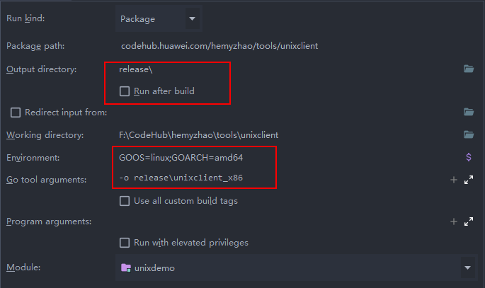

# 编译指导

## unixclient_x86
Run Kind: 选择Package

Package Path: codehub.huawei.com/hemyzhao/tools/efficiency/unixclient

**去勾选“Run After Build”**

Output directory: 当前工程的release目录。可以设置为`release\`

Working directory: 工程目录

Environment: **GOOS=linux;GOARCH=amd64**

Go tool arguments: **-o release\unixclient_x86**

Module：选择unixclient

如图：

## unixclient_arm
Run Kind: 选择Package

Package Path: codehub.huawei.com/hemyzhao/tools/efficiency/unixclient

**去勾选“Run After Build”**

Output directory: 当前工程的release目录。可以设置为`release\`

Working directory: 工程目录

Environment: **GOOS=linux;GOARCH=arm64**

Go tool arguments: **-o release\unixclient_arm**

Module：选择unixclient

如图：

## unixclient_windows